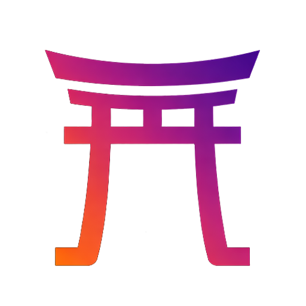

<p align="center">
  
</p>

<h1 align="center">Torii</h1>

<p align="center">
  <em>A community fork of <a href="https://github.com/ppy/osu">osu! (lazer)</a> with a private server and some extra
  client polish.</em>
</p>

<p align="center">
  <a href="https://github.com/ShikkesoraSIM/torii-osu/releases/latest">
    
  </a>
  <a href="https://github.com/ShikkesoraSIM/torii-osu/releases">
    
  </a>
</p>

---

> [!IMPORTANT]
> **Torii is an unofficial fork of [osu!](https://github.com/ppy/osu).**
>
> - We are **not affiliated with, endorsed by, or supported by ppy Pty Ltd**, peppy, or the osu! development team.
> - **osu!**, the **"osu!"** name, the **"lazer"** codename, and all related branding are trademarks of **ppy Pty Ltd**. Torii is a separately-named project; the May 2026 binary rebrand drops the "osu!" prefix from distributed binaries to stay clear of that trademark.
> - **Please support the original project.** osu! is free, lovingly maintained, and the only reason this fork can exist. If you enjoy playing rhythm games, the best thing you can do is:
>   - Play on the [official osu! servers](https://osu.ppy.sh) (your scores there count for the real leaderboards).
>   - Become an [osu! supporter](https://osu.ppy.sh/home/support) — it directly funds upstream development.
>   - File issues / PRs on the [upstream repo](https://github.com/ppy/osu) instead of pinging the upstream team about Torii.
> - Torii exists to experiment with ideas that may not fit upstream's roadmap, run a small community server, and to learn. **It is not a replacement for osu! and we do not want it to be.** If you're new to the game, please install [official osu!](https://osu.ppy.sh/home/download) first.

---

## What Torii is

A buildable client + a small private server. The client is forked from osu! lazer with extra UI surfaces, a few new gameplay-adjacent systems, and performance work. The server is a separate project (`g0v0-server`) that hosts scores, leaderboards, multiplayer rooms, chat, and presence for users who choose to play there.

**You do not need to use the Torii server to use the Torii client.** You can sign in against the official osu! server at any time — the client lets you switch via Settings → Torii → Server.

## What it is **not**

- It is not "modded osu!" or "cheat osu!". No anti-cheat relaxation, no rank-skipping, no PP injection. Submitting scores to the official osu! server while running this client is unsupported and explicitly discouraged by both us and upstream — the official server's anti-cheat will detect modified clients and restrict you.
- It is not a "private osu!" replacement aimed at general players. We do not advertise the server, we do not link the client in upstream issues / Discord, and we don't try to pull anyone away from official osu!. If you found Torii on your own and want to make it your main rhythm-game home, that's entirely your call — we just won't be the ones recruiting people here.

---

## Release streams

Torii ships two parallel streams, picked via **Settings → General → Updates → Release stream**:

| Stream | Tag suffix | What you get |
|---|---|---|
| **Torii** (default, stable) | `vYYYY.MDD.N-torii` | The stream this README describes. Conservative, close to upstream, the path the majority of users should be on. |
| **Torii Nova** (experimental) | `vYYYY.MDD.N-nova` | An opt-in faster-moving stream that tests platform / rendering changes before they reach stable. See [the Nova section](#torii-nova-experimental-stream) for what it adds. |

The two streams share the same install — switching is a one-click in settings + a Velopack-managed restart. Your data (beatmaps, scores, configs, skins) carries over either way.

---

## Features (stable stream, top-to-bottom)

### Client identity & UI

- **Torii brand**: gradient torii-gate logo across the window, taskbar, file associations, badges, and shortcuts. The May 2026 binary rebrand renamed the executable `osu-torii.exe` → `torii.exe` and switched the displayed product name to "Torii Nova" across window chrome, file associations, the Android launcher, and the macOS bundle. A small `osu-torii.exe` shim ships alongside on Windows so pre-rebrand taskbar pins keep working without re-pinning.
- **Torii toolbar** — a Torii-themed alpha indicator and quick-access strip alongside the upstream toolbar.
- **Settings → Torii section** where every Torii-specific knob lives instead of being scattered across upstream panels:
  - Server selection (Torii vs. official) + auth flow
  - Briefing overlay defaults (the daily-portal greeting screen)
  - Aura presets (see below)
  - Gameplay tweaks specific to Torii
  - Storage management + Android-specific options
  - Experimental flags (renderer choice, latency mode, etc.)

### Auras

Cosmetic effects rendered around your username + avatar in user panels. Currently registered presets:

- **Admin / Dev / Mod / QAT** — staff-only auras, server-assigned
- **Supporter** — for community supporters
- **Bug Finder** — for users who land merged bug fixes / detailed reports
- **Goof** — for the goofs

Auras are server-attested. The client renders whatever the server says you're entitled to via `GET /api/v2/me/aura-catalog`; you can pick which one to display from the in-game settings picker.

### Verified-client badge

A small gradient torii-gate icon shown next to online users in the Friends / Online overlays — but **only** when the Torii server has matched their build hash to a CI-registered release. This means you can tell at a glance whether someone is on a verified Torii build vs. just any custom client connected to the server. The badge is not granted by self-attestation — it requires the executable's `osu.Game.dll` md5 to match a hash registered by CI on release.

### Torii Briefing

A daily portal overlay greeting users on first login of the day. Shows server status, what's new since last login, friend activity, and quick-jump entries. Designed so the home screen of a Torii session has more "warmth" than an empty Lazer main menu.

### Performance work

- **Hiccup queue** — gameplay frame-time outliers are detected, snapshotted, and (with explicit opt-in) uploaded to the Torii server so we can see real-world stutter patterns instead of just our own profiles. Hiccup polling is paused during gameplay so we never *cause* a hiccup measuring one.
- **Low latency providers** — NVIDIA Reflex (on RTX) and AMD Anti-Lag 2 (on RDNA) are wired into the Direct3D 11 backend, with a settings panel that shows which one applies to the current GPU.

### Audio

Audio packages are pinned to ppy's own `ppy.ManagedBass*` forks, matching official osu! 1-for-1 — meaning all of upstream's BASS audio fixes (WASAPI exclusive-mode handling, audio-device hot-plug, MIDI backend patches) ship in Torii too. We deliberately don't run on vanilla ManagedBass, because vanilla is missing those patches.

### Skinning extras

#### Per-combo-color circle textures (legacy skins)

Drop numbered variants next to the standard skin files and Torii picks the one whose number matches the currently-active combo color slot from `skin.ini`'s `[Colours]` section.

| Standard file | Numbered variants | Used by |
|---|---|---|
| `hitcircle.png` | `hitcircle1.png` … `hitcircle8.png` | Regular hit circles |
| `hitcircleoverlay.png` | `hitcircleoverlay1.png` … `hitcircleoverlay8.png` | Overlay ring on hit circles |
| `approachcircle.png` | `approachcircle1.png` … `approachcircle8.png` | Approach circles |
| `sliderstartcircle.png` (+ overlay) | `sliderstartcircle1.png` … `sliderstartcircle8.png` (+ overlay variants) | Slider start circle |
| `sliderendcircle.png` (+ overlay) | `sliderendcircle1.png` … `sliderendcircle8.png` (+ overlay variants) | Slider end circle |

The number matches the Combo slot — `hitcircle1.png` ↔ `Combo1`, `hitcircle2.png` ↔ `Combo2`, etc.

- The combo color is still applied as a tint over the variant — paint your variants in white/grayscale to let `skin.ini`'s combo colors show through, or in pre-tinted mid-tones for a colored-on-colored effect. Hidden / Flashlight / dim / fade animations all keep working because the tint pipeline is unchanged.
- `@2x` HD textures work the same way they do everywhere else in legacy skins (`hitcircle1@2x.png`, `approachcircle1@2x.png`, etc.). No extra config.
- **Missing slots cycle through the variants that DO exist** instead of dropping back to plain `hitcircle.png`. If you ship `hitcircle1.png` + `hitcircle2.png` against a `skin.ini` defining four combo colors, Combo3 uses `hitcircle1.png` again and Combo4 uses `hitcircle2.png` — so a skin with custom variants always shows variants, never a plain fallback halfway through the cycle. If the skin ships **zero** numbered variants (the today-default), every combo renders the regular `hitcircle.png` with its combo-color tint exactly like before.
- The cycling works independently per element family — you can ship only `approachcircle1..4.png` and leave hitcircles alone, or only `hitcircle1.png` + `approachcircle1.png` + `approachcircle2.png` and everything else fallbacks normally. Each layer (`hitcircle`, `hitcircleoverlay`, `approachcircle`, slider start/end + their overlays) is resolved independently.
- This is purely additive — skins that don't ship any numbered variants render exactly as they always have.

The slot index for the active hit object resolves the same way the combo color itself does: `comboIndexWithOffsets mod (number of Combo entries in skin.ini)`. The variant lookup then either uses the variant for that slot (if shipped) or cycles through the present variants by ordered index. Worked example: `skin.ini` with `Combo1..Combo4` + skin shipping `hitcircle1` + `hitcircle3` → Combo1 = hc1, Combo2 = hc3 (next available variant by cycle), Combo3 = hc3, Combo4 = hc3. Ship contiguous variants (1..N for the N colors you defined) for the most predictable look.

#### Distinct image for the layout-dim layer

Drop `layout-background.png` into your skin folder to use a different image for the dimmed background that appears behind menus / settings (when the layout-scaling kicks in) than the one used as the main-menu background:

| File | Used by |
|---|---|
| `menu-background.png` (or .jpg) | Main menu background. Shown full-screen on the welcome / song-select / browse screens. |
| `layout-background.png` (or .jpg) | The dimmed background behind menus when the Settings → Graphics → Layout scaling is active. Falls back to `menu-background` if not shipped. |

This is paired with a wider `Background dim` slider range — the slider in Settings → Graphics → Layout now goes from 0% to 100% (was 50%-100%) so the layout-background image can be pushed all the way to invisible if you only want the menu-background visible during the scale-down transition.

Both elements still get the regular skin-lookup chain (`@2x` HD textures, per-beatmap skin overrides, fallback through the user skin → default skin) — no extra config required.

### Mod policy (ranked surface)

Two upstream rate-altering mods don't yield PP on Torii because the difficulty calculator can't see their effect — it runs against the base beatmap rate only, with no "realtime / per-window rate" hook:

| Mod | Acronym | Why it's unranked |
|---|---|---|
| Adaptive Speed | `AS` | Rate adapts mid-play to user accuracy. A player effectively averaging 0.5x would still be scored against the base rate. |
| Wind Down | `WD` | Rate ramps from `InitialRate` down to `FinalRate` over the map. A 2.0x → 0.5x wind-down has an average rate well below 1.0 but gets scored as if played at base rate — net PP gain from an easier play. |

Wind Up (`WU`) stays ranked because it only ever makes the play *harder* than baseline. Both client (the mod selector marks `AS` / `WD` as unranked) and server (`g0v0-server`'s `_mods_can_get_pp` rejects them across every ruleset) enforce this — submitting from a modified client that strips the client-side flag still doesn't get PP.

This list will shrink the moment lazer grows realtime rate-aware diffcalc upstream; until then the gate exists to keep the PP economy honest.

### Velopack updater with channel routing

Torii uses [Velopack](https://github.com/velopack/velopack) for updates. The release pipeline tags releases with `-torii` for stable (master) and `-nova` for experimental (nova branch), and the in-client Updater pins users to their chosen stream — Nova users only see `-nova` prereleases, stable users only see `-torii` releases. Switching streams is one click in Settings.

---

## Torii Nova (experimental stream)

Nova is where we test things that aren't safe to push to every Torii user yet. If you don't already know what's in Nova and why you want it, you almost certainly want to stay on stable.

Switch via **Settings → General → Updates → Release stream → Torii Nova (Experimental)**. The client confirms before switching and downloads a fresh Nova build over your current install (data is preserved).

What Nova currently adds on top of stable (everything else — the brand, icon, binary rename, audio fixes, badge, shim, hidden D3D12 dropdown, config-migration — ships on stable too):

- **`.NET 10` runtime chain** across the whole client. JIT improvements, lower-allocation GC, and SIMD path improvements that matter most for gameplay frame pacing. Stable is still on `.NET 8`.
- **CoreCLR runtime** on Android, replacing Mono. Same JIT/GC improvements story as desktop.
- **Deferred renderer as default** on first launch. Stable defaults to the framework's immediate renderer for safety; Nova flips this to Deferred so we can shake out edge cases at scale.
- **Direct3D 12 backend (experimental, opt-in on both streams)** — a fully-wired D3D12 path in our Veldrid fork. **Deliberately hidden** from the in-settings renderer dropdown on both streams to keep curious users from picking it on a hunch; the backend can be opted into by editing `framework.ini` (`%APPDATA%\osu-torii\framework.ini`) and setting `Renderer = Deferred_Direct3D12`. Nova is where it gets dogfooded with the Deferred-default UX, while stable users on Direct3D 11 immediate keep their existing renderer untouched.
- **Renderer dropdown re-labels** — Deferred entries display as `... (Nova)` (e.g. `Direct3D 11 (Nova)`) so you can tell which path you're on at a glance.

When Nova features bed in, they get merged down to stable. Nothing in Nova is intended to live there forever — it's a buffer, not a separate product.

---

## The Torii server

`g0v0-server` is a Python (FastAPI) server that talks osu!'s v2 API + spectator + chat protocols. It hosts:

- Scores + leaderboards (per-beatmap + global + country, with daily-challenge support)
- Multiplayer rooms (osu!, taiko, catch, mania)
- Chat (channels + PMs)
- User presence + spectator
- Beatmap proxy + tag/rating systems
- A small admin dashboard for restriction / moderation

The server is **private** and **invite-only** at the moment. If you have an account, you can sign in by switching the server endpoint in `Settings → Torii → Server`. We do not advertise the server publicly and do not accept open signups via the client.

---

## Download

> [!WARNING]
> **Do NOT install Torii if you have not already played osu!.** This is a fork, not the real thing. Install [official osu!](https://osu.ppy.sh/home/download) first. If you decide you want Torii anyway, install it *alongside* official osu! — they use separate data directories and don't conflict.

Grab the latest release from the [Releases page](https://github.com/ShikkesoraSIM/torii-osu/releases). Each release ships:

| Platform | File |
|---|---|
| Windows (x64) installer | `install-win-x64.exe` |
| Windows (ARM64) installer | `install-win-arm64.exe` |
| Windows portable | `portable-win-x64.zip` / `portable-win-arm64.zip` |
| Linux AppImage | `torii-linux-x64.AppImage` / `torii-linux-arm64.AppImage` |
| Linux portable tarball | `portable-linux-x64.tar.gz` / `portable-linux-arm64.tar.gz` |
| macOS (Intel) | `osu.app.Intel.zip` |
| macOS (Apple Silicon) | `osu.app.Apple.Silicon.zip` |
| Android | `torii.apk` |

Existing installs auto-update via Velopack. Data directory is preserved (`%APPDATA%\osu-torii\` on Windows, equivalent on other platforms), so beatmaps, scores, replays, and settings carry over.

---

## Building from source

This repository is a fork of [`ppy/osu`](https://github.com/ppy/osu). You need three sibling checkouts to build:

```
parent-dir/
├── torii-osu          # this repository
├── torii-framework    # https://github.com/ShikkesoraSIM/torii-framework  (osu-framework fork)
└── torii-veldrid      # https://github.com/ShikkesoraSIM/torii-veldrid    (Veldrid fork)
```

`torii-resources` (a fork of `osu-resources`) is pulled as a NuGet package — you don't need a local checkout unless you're modifying resources.

### Prerequisites

- [.NET 8 SDK](https://dotnet.microsoft.com/download) for stable builds (Nova builds bump to .NET 10 — see [the Nova section](#torii-nova-experimental-stream) — and require both 8 and 10 installed)
- An IDE that supports C# 12+ — [Visual Studio 2022 17.8+](https://visualstudio.microsoft.com/), [JetBrains Rider](https://www.jetbrains.com/rider/), or [VS Code](https://code.visualstudio.com/) with the C# Dev Kit
- Windows is the primary supported dev platform. Linux + macOS builds work via the same `dotnet` CLI but get less day-to-day testing.

### Quick start

```shell
git clone https://github.com/ShikkesoraSIM/torii-framework.git
git clone https://github.com/ShikkesoraSIM/torii-veldrid.git
git clone https://github.com/ShikkesoraSIM/torii-osu.git

cd torii-veldrid
dotnet pack src/Veldrid/Veldrid.csproj -c Release -o bin/Packages/Release
dotnet pack src/Veldrid.MetalBindings/Veldrid.MetalBindings.csproj -c Release -o bin/Packages/Release
dotnet pack src/Veldrid.OpenGLBindings/Veldrid.OpenGLBindings.csproj -c Release -o bin/Packages/Release

cd ../torii-osu
dotnet run --project osu.Desktop -c Debug
```

The first run takes a few minutes (restore + initial build). Subsequent runs are fast.

To build the Nova experimental tree, check out the `nova` branch in `torii-osu` (and use the framework + veldrid commit hashes that branch's `build-gu.yml` env declares — those are pinned per-release).

---

## Contributing

Contributions are welcome, but **please direct general osu! improvements at [upstream](https://github.com/ppy/osu) instead.** Anything that isn't Torii-specific (rulesets, beatmap features, mod logic, core gameplay) lands upstream first; Torii merges upstream regularly. Submitting it here means it only ever ships to Torii users, which isn't what most contributors want.

**Torii-specific work is welcome here**: Torii settings, the briefing overlay, the aura system, performance telemetry, server integration tweaks. Nova-specific (D3D12, .NET 10, Deferred-default) PRs target the `nova` branch.

Before opening a PR:

- Run `dotnet format` on changed files.
- Don't bump upstream-shared package versions without a good reason (we try to stay close to upstream so merges don't conflict).
- If a change touches behaviour visible to a server, it probably needs a coordinated change in [`g0v0-server`](https://github.com/GooGuTeam/g0v0-server) — flag that in the PR.

---

## License

The Torii client source is licensed under the [MIT License](LICENCE), inheriting from upstream osu!. See the [LICENCE](LICENCE) file for details.

> [!NOTE]
> **MIT does NOT cover the "osu!" / "ppy" / "lazer" branding** — those are trademarks of ppy Pty Ltd. The May 2026 binary rebrand exists precisely to stay clear of that trademark in distributed binaries. Please do not redistribute Torii under the osu! name.
>
> Game resources (sound effects, fonts, default skin assets) inherited from upstream are covered by the separate [ppy/osu-resources](https://github.com/ppy/osu-resources) license. Torii-original assets (the gradient torii-gate logo, Torii-specific UI graphics) are © Torii Team and available under the same MIT license as the source.

---

## Credits

- [ppy](https://github.com/ppy) and the osu! lazer team — without their work, none of this would exist. Please support [osu!](https://osu.ppy.sh) and consider becoming a [supporter](https://osu.ppy.sh/home/support).
- [shigetiro](https://github.com/shigetiro) — earlier fork work that Torii builds on.
- [GooGuTeam](https://github.com/GooGuTeam) — `g0v0-server` upstream + ongoing collaboration on the server side.
- The Torii community — for bug reports, ideas, and putting up with experimental builds on the Nova stream.

---

<p align="center">
  <sub>Made with respect for the original project. Please support <a href="https://osu.ppy.sh">osu!</a>.</sub>
</p>
